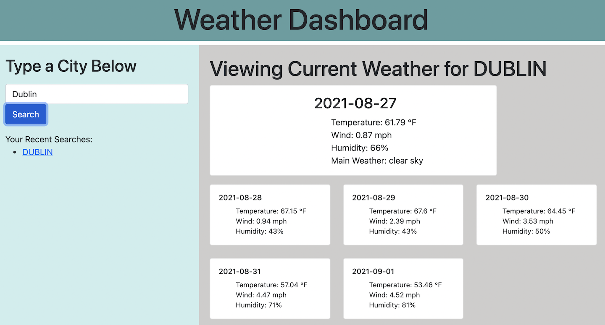

# Weather-Dashboard-HW 

## Description

This app allows a user to search for a city and they can then view the weather for that city. They can see not only current weather, but also a five-day forecast. The app also saves recent searches.

## Table of Contents

- [Assets](#assets)
- [License](#license)
- [GitHub Profile](#github-profile)
- [Contact by Email](#email)

## Assets

[Live Website](https://audrey-g37.github.io/Weather-Dashboard-HW/)

## License

This project is licensed with MIT.

### GitHub Profile

[My Profile](https://github.com/audrey-g37)

### Email

audrey.gillies@gmail.com
